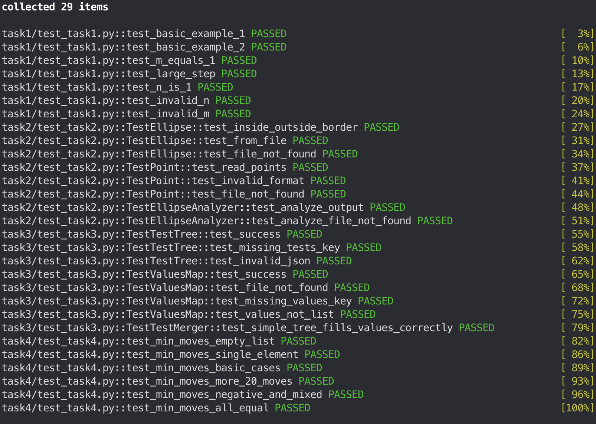

# HTPerformanceLabTest
## Структура проекта


```
.
├── author.txt
├── README.md
├── task1
│   ├── task1.py
│   └── test_task1.py
├── task2
│   ├── ellipse.txt
│   ├── points.txt
│   ├── task2.py
│   └── test_task2.py
├── task3
│   ├── output.json
│   ├── task3.py
│   ├── test_task3.py
│   ├── tests.json
│   └── values.json
└── task4
    ├── nums.txt
    ├── task4.py
    └── test_task4.py
```

## Прохождение тестов
